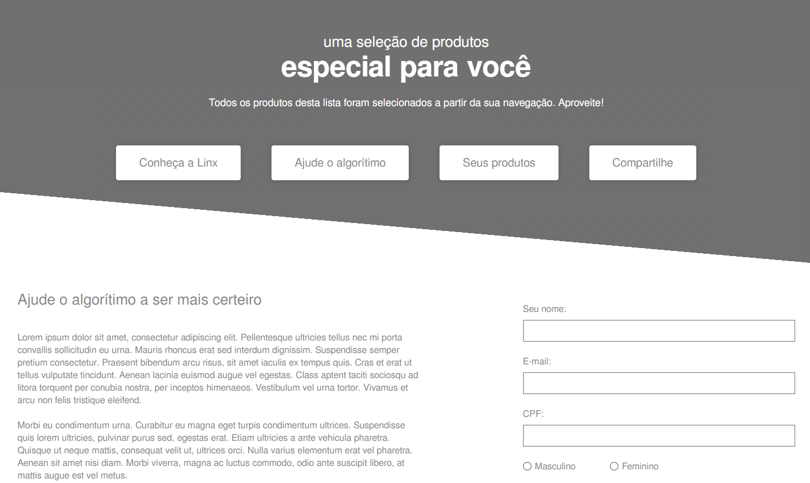

# Nome do projeto

<!---Esses são exemplos. Veja https://shields.io para outras pessoas ou para personalizar este conjunto de escudos. Você pode querer incluir dependências, status do projeto e informações de licença aqui--->

> Desafio proposta para a vaga de Frontend Developer para o time de Customer Operations da Linx Impulse. Consiste em uma homepage de um ecommerce, listando produtos e contendo formulários de newsletter.

### Ajustes e melhorias

Foram concluídas as seguintes etapas:

- [x] Listagem de produtos vindos da API utlizando o Fetch (poderia ter utilizado Axios, mas preferi não importar outra lib)
- [x] Validação dos campos dos formulários utilizando o validatejs
- [x] Máscara de CPF utilizando a lib VMasker
- [x] Site responsivo
- [x] Hospedado utilizando o [Surge.sh](https://surge.sh/), pela facilidade e por ser free.

## 🚀 Link para testar o projeto <nome_do_projeto>

[Site hospedado](http://front-end-challenge-linx.surge.sh/)

## 📫 Tecnologias e arquitetura utilizada no projeto <nome_do_projeto>

1. Feito em HTML, CSS e JS puro.
2. Utilizado Module Pattern para organizar o código JS.
3. ValidateJS e VMasker para validar os formulários.

[⬆ Voltar ao topo](#nome-do-projeto) 